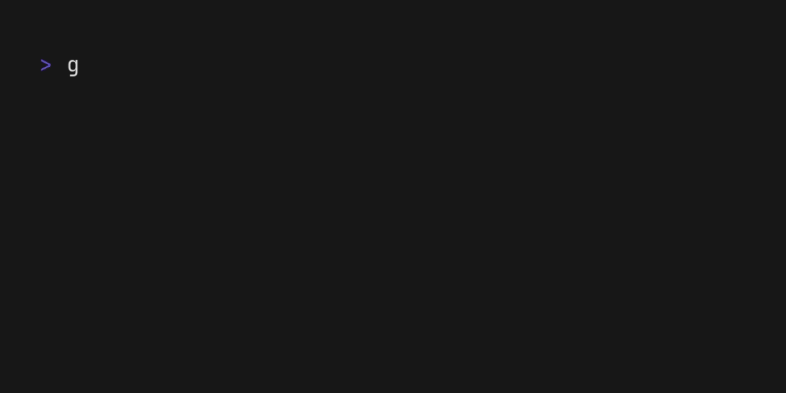

# Sir Lints-a-Lot

The honored Sir Lints-a-Lot of the Knights of the Round Table has arrived to check whether your code has unused variables or functions. 

If your code is pure and free of unused bits, you may pass. But if not, beware! For Sir Lints-a-Lot will unleash the Killer Rabbit of code reviews, and only the Holy Hand Grenade of Refactoring can save you.

---

- Checks for unused variables and functions in ~~Monty~~ Python files.

## boot.dev hackathon
This project was created as part of the 2025 Boot.dev hackathon. You can find more information about the hackathon [here](https://blog.boot.dev/news/hackathon-2025/). 


## Installation

```bash
$ git clone https://github.com/shumy/Sir-Lints-a-Lot.git
```
## Usage

Copy your python files to the `Sir-Lints-a-Lot/python_files` directory and run the following commands:

```bash
$ cd Sir-Lints-a-Lot
$ go run .
```
then follow the instructions provided by the mighty Knight, selecting the file you want to check and the scope it will check.

### Demo


## Uninstallation 

```bash
$ rm -rf Sir-Lints-a-Lot
```


